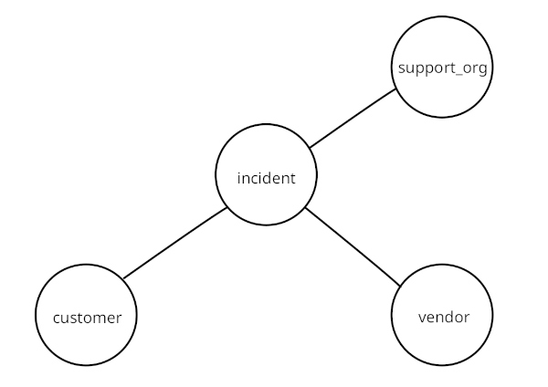

# Predviđanje preraspodele tiketa sistema podrške

Projekat iz kursa Mašinsko Učenje, Matematički fakultet Univerziteta u Beogradu. Projekat prati ideju predstavljenu u naučnom radu [Predicting help desk ticket reassignments with graph convolutional
networks](https://www.sciencedirect.com/science/article/pii/S2666827021001195) (J. Schad, R. Sambasivan, C. Woodward).

## Uvod

Sistem podrške (eng. _help desk_) je informacioni sistem za prijavu tehničkih problema softvera. Korisnici softvera prijavljuju probleme otvaranjem tiketa (eng. _ticket_). Tiket sadrži informacije o samom problemu sa softverom i korisniku koji je prijavio problem. Zatim se određuje osoba ili organizacija koja je zadužena za rešavanje problema i te informacije se takođe unose u tiket. Može se desiti da je tiket potrebno ponovo zadužiti (eng. _reassign_) na neku drugu osobu (ili organizaciju). U interesu svake kompanije je brzo razrešavanje prijavljenih korisničkih problema. Prebacivanje odgovornosti sa jedne osobe na drugu rezultuje u povećanju potrebnog vremena za rešavanje problema, kao i povećanju troškova. Upravo je iz ovih razloga neophodno brzo i precizno identifikovati složenost problema kako bi se za njegovo rešavanje zadužili odgovarajući inženjeri.

## Reprezentacija podataka u vidu grafa

Statuse i napredak u razrešavanju tiketa je moguće ispratiti izvršavanjem upita nad podacima. Relacioni modeli podataka omogućavaju efikasno izvršavanje upita pomoću indeksa. Međutim, često nije poznato koji upiti će se izvršavati nad podacima što znači da će se često izvršavati spajanje više tabela i onemogućeno je indeksiranje.

Modelovanjem podataka u vidu grafa, pojednostavljeno je izvršavanje upita koji nisu unapred poznati. Umesto spajanja više tabela, izvršava se obilazak grafa što je efikasnija i manje zahtevna operacija.
Proces razrešavanja tiketa može se predstaviti sledećim grafom:



Razlikujemo četiri entiteta u postupku razrešavanja tiketa:

- customer - korisnik koji je prijavio problem
- incident - detalji problema problema
- support_org - organizacija zadužena za rešavanje problema
- vendor - neki problemi zahtevaju dodatnu podršku od drugih vendora

## Skup podataka

Skup podataka koji je korišćen u radu je [Incident management process enriched event log](https://archive.ics.uci.edu/dataset/498/incident+management+process+enriched+event+log) koji se može naći na UCI Machine Learning Repository. Podaci su prikupljeni iz logova [ServiceNow](https://www.servicenow.com/now-platform.html) platforme (tačnije, sa njihovog [IT Service Management](https://www.servicenow.com/products/itsm.html) servisa ) koju koristi jedna IT firma. U skupu postoji veliki broj nedostajućih vrednosti zbog privatnosti podataka.

Skup sadrži 141712 instanci sa 36 atributa. Tačan opis svakog atributa može se naći [ovde](https://archive.ics.uci.edu/dataset/498/incident+management+process+enriched+event+log). Atribut od značaja u projektu je `reassignment_count` koji predstavlja koliko puta je promenjen zaduženi za rešavanje incidenta. Ovaj atribut je transformisan u indikator `reassigned` koji označava da li je bilo promene zaduženja za neki incident. Atribut `reassigned` je ciljna promenljiva problema binarne klasifikacije pomoću grafovske neuronske mreže.

Svaki od ovih tipova čvorova pomenutih ranije ima svoje atribute.

| Incident                | Support organization |  Customer | Vendor |
| ----------------------- | :------------------: | --------: | :----: |
| active                  |   assignment_group   | opened_by | vendor |
| knowledge               |     assigned_to      |           |        |
| u_priority_confirmation |                      |           |        |
| reopen_count            |                      |           |        |
| sys_mod_count           |                      |           |        |
| caller_id               |                      |           |        |
| sys_updated_by          |                      |           |        |
| contact_type            |                      |           |        |
| location                |                      |           |        |
| category                |                      |           |        |
| subcategory             |                      |           |        |
| u_symptom               |                      |           |        |
| impact                  |                      |           |        |
| urgency                 |                      |           |        |
| priority                |                      |           |        |
| closed_code             |                      |           |        |
| resolved_by             |                      |           |        |
| **reassigned\***        |                      |           |        |

Cilj binarne klasifikacije je odrediti da li čvor tipa incident pripada klasi 0 ili 1.

## Implementacija

Paketi korišćeni u implementaciji:

- [numpy](https://numpy.org/doc/stable/)
- [pandas](https://pandas.pydata.org/docs/)
- [matplotlib](https://matplotlib.org/stable/index.html)
- [PyTorch](https://pytorch.org/docs/stable/index.html)
- [PyTorch Geometric](https://pytorch-geometric.readthedocs.io/en/latest/)
- [scikit-learn](https://scikit-learn.org/stable/modules/classes.html)

Instalacija paketa:

```
pip install numpy pandas matplotlib torch torch_geometric scikit-learn
```

Graf podataka (hetero_data.pt) i istrenirani model (model.pt) se nalaze u direktorijumu [data](https://github.com/kunict11/GCN-Ticket-Reassignment-Prediction/blob/main/data).

## Literatura

1. [Predicting help desk ticket reassignments with graph convolutional networks, Jörg Schad, Rajiv Sambasivan, Christopher Woodward, 2022](https://www.sciencedirect.com/science/article/pii/S2666827021001195)
2. [Hands-On Graph Neural Networks Using Python, Maxime Labonne, 2023](https://www.packtpub.com/product/hands-on-graph-neural-networks-using-python/9781804617526)
3. [Inductive Representation Learning on Large Graphs, William L. Hamilton, Rex Ying, Jure Leskovec, 2018](https://arxiv.org/abs/1706.02216)
4. [Graph Neural Networks: A Review of Methods and Applications, Jie Zhou, Ganqu Cui, Shengding Hu, Zhengyan Zhang, Cheng Yang, Zhiyuan Liu, Lifeng Wang, Changcheng Li, Maosong Sun, 2020](https://arxiv.org/abs/1812.08434)
5. [PyG Documentation](https://pytorch-geometric.readthedocs.io/en/latest/)
